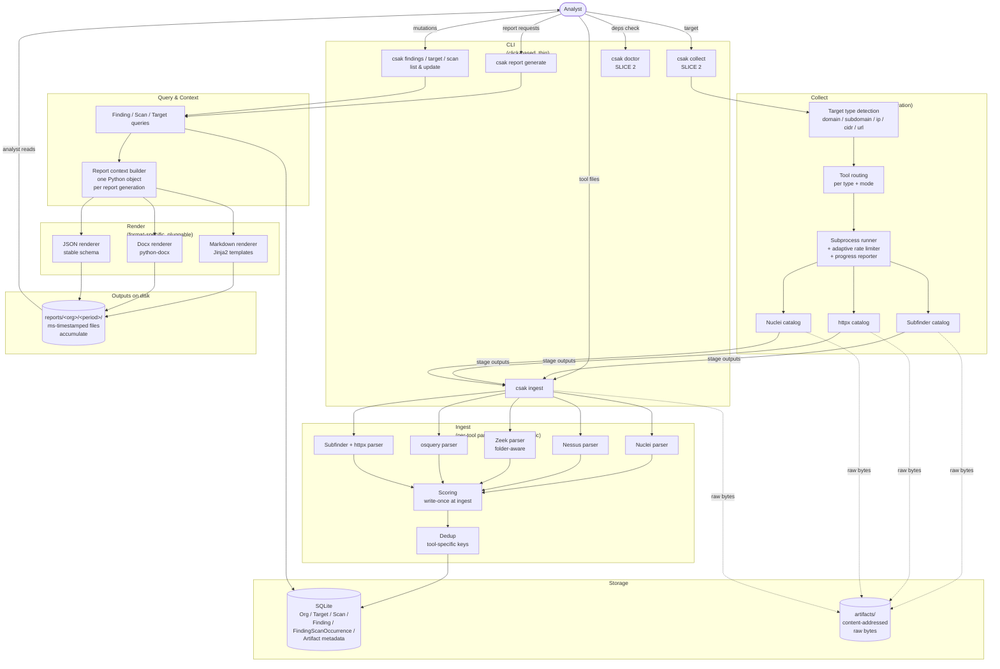

# Architecture Overview

> Companion to [[specs/slice-1|slice 1 spec]], [[specs/slice-2|slice 2 spec]], and [[specs/slice-3|slice 3 spec]]. The specs are authoritative for every decision; this page is the map. A new contributor should be able to read this in five minutes and know where each responsibility lives and where to look in the specs for detail. This page also covers what `architecture/data-flow` would have covered — the two have been folded together.
>
> **Slice 1 implemented 2026-04-24.** The slice 1 module layout below matches the repository layout; the slice 1 walkthrough matches shipped behavior.
>
> **Slice 2 implemented 2026-04-25 (under test).** The collect module section and the slice 2 walkthrough reflect the [[specs/slice-2|slice 2 spec]]; the diagram shows where collect attaches.
>
> **Slice 3 in design 2026-04-25.** The slice 3 module section below describes the additions (recursion runner, type registry, plugin discovery) per the [[specs/slice-3|slice 3 spec]] (status: draft). Walkthrough not yet added — will follow when the spec is approved.

## What CSAK is, briefly

CSAK ingests security-tool output, scores findings deterministically, and emits reports. Slice 1 is the pipeline from pre-collected tool output to rendered report. Slice 2 adds tool *execution* — CSAK identifies what kind of target the analyst gave it and runs the appropriate tools, feeding their output into the slice 1 pipeline. Recursion (slice 3) and LLM features (later slice) attach to the same pipeline without reshaping it.

The four-step product model is **intake → collect → triage → report**. Slice 1 ships intake-as-file-handoff plus triage and report. Slice 2 ships **collect** for the on-demand active tools that earn their keep from a CLI: Subfinder, httpx, Nuclei.

## System diagram



Three things worth noting about the diagram:

- **Arrows flow one way through the pipeline.** The collect side and ingest side both write to storage; the render side reads from it. No feedback loops in slices 1 or 2 — no retriage, no report-to-database writes, no cross-report comparison. (Slice 3 introduces recursion, which adds a feedback loop from findings back to collect.)
- **Collect (slice 2) is a new on-ramp to ingest, not a replacement.** Stage outputs from subfinder, httpx, and nuclei become Artifacts that flow through the existing slice 1 ingest pipeline. Findings produced by `csak collect` are indistinguishable from Findings produced by `csak ingest`.
- **The render column is pluggable by format.** Adding HTML or PDF later means adding one more renderer that consumes the same report context. No changes upstream.

## Module boundaries

Six modules. Each owns a narrow responsibility; the boundaries match the diagram columns and the shipped repo's `src/csak/` layout. Five modules are slice 1; the sixth (collect) is slice 2.

### 1. CLI (thin, click-based) — slice 1

**Owns:** argument parsing, command dispatch, user-facing output formatting (error messages, progress indicators, table output for `list` commands). Nothing more.

**Does not own:** business logic, data access, rendering, tool execution. The CLI's `csak report generate` is a small handler that parses flags, calls the query layer, calls the context builder, calls the relevant renderers, and exits. Every substantive thing happens in the modules below.

**Lives in:** `csak/cli/` — one file per top-level command (`ingest.py`, `report.py`, `findings.py`, `target.py`, `scan.py`, `org.py`, plus `collect.py` and `doctor.py` in slice 2), and `main.py` as the click group entrypoint.

**Why thin:** a fat CLI is the classic way to end up unable to build a TUI or web UI later. Slice 1 is CLI-only; slice 3+ might need a different front end. Keeping the CLI thin keeps that option alive.

**Table output convention:** every `list` command puts an `ID` column first (truncated to 8 characters for display). Downstream commands — `findings update`, `findings show`, `target update` — accept either the full UUID or any unambiguous prefix.

### 2. Collect (target detection + tool orchestration) — slice 2

**Owns:** taking a target string, identifying its type (domain / subdomain / ip / cidr / url), routing it to the appropriate subset of orchestrated tools per the active mode, running each tool as a subprocess, capturing its output as an Artifact, applying adaptive rate limiting, surfacing live progress to the analyst, and handing each stage's Artifact to the ingest pipeline.

**Does not own:** parsing tool output (that's ingest's job — the same parser that handles a hand-uploaded Nuclei file handles a collect-produced Nuclei file), storing entities (storage's job), the eventual reporting (render's job).

**Lives in:** `csak/collect/` — `detect.py` for target-type identification, `router.py` for the type/mode → tool-set decision matrix, `runner.py` for the subprocess + rate-limiter + progress wrapper, `tool.py` for the shared `Tool` interface, `tools/<tool>.py` for each per-tool catalog module (`subfinder.py`, `httpx.py`, `nuclei.py`).

**The tool catalog is Python module per tool.** Each module implements the shared `Tool` interface and carries: binary name, minimum version, install command, `applies_to(target_type)` predicate, per-mode invocation recipes, progress-line parser, rate-limit signal detector, and attribution comments for any recipe adapted from reconFTW. Three tools in slice 2 → three modules. Picked Python over YAML because each tool needs real logic (target-type predicates, conditional flag building, tool-specific stderr pattern matching) that YAML can't express without growing an ugly schema. Reversal to YAML is cheap if the catalog grows past ~10 tools and patterns stabilize.

**The `csak doctor` command lives in `csak/cli/doctor.py`** but reads from the catalog modules to know what to check for. Doctor is the only place where CSAK might modify the analyst's system (running `go install` to fetch missing binaries), and it always asks permission first.

See [[specs/slice-2|slice 2 spec §Tool catalog]] and §Target type detection and tool routing for the rules collect must respect.

### 3. Ingest (per-tool parsers + scoring + dedup) — slice 1

**Owns:** taking a file path (or directory, for Zeek) and a tool identifier, producing Scans, Artifacts, and Findings. Assigning severity, confidence, and priority at the moment a Finding is first observed. Running dedup against existing Findings for the same Org.

**Does not own:** the database schema (that's storage), analyst-facing commands (that's CLI), the report rendering (that's render), tool execution (that's collect, slice 2). An ingestor doesn't know what a Report is, and doesn't care whether its input came from a hand-upload or from collect.

**Lives in:** `csak/ingest/` — one module per tool (`nuclei.py`, `nessus.py`, `zeek.py`, `osquery.py`, `probe.py` for Subfinder+httpx), plus `pipeline.py` as the orchestrator, `scoring.py` for the scoring formula and tables, `dedup.py` for the per-tool dedup keys, `targets.py` for the promotion logic, and `parser.py` for the shared parser interface.

**The parser interface** is the single seam: each parser exposes `parse(path) -> ParseResult` where `ParseResult` carries a `ParsedScan` plus a list of `ProtoFinding`. All five slice 1 parsers satisfy this. A sixth parser for reconFTW JSON or generic CSV would slot into the same interface — both currently deferred indefinitely (the slice 2 native orchestrator removes most of the reconFTW JSON ingest motivation).

See [[specs/slice-1|slice 1 spec §Scoring]] and §Dedup for the rules each parser must respect.

### 4. Storage (SQLite + flat-file artifacts) — slice 1

**Owns:** persistence. SQLite holds the entity rows (Org, Target, Scan, Finding, FindingScanOccurrence, Artifact metadata). The filesystem under `artifacts/<hash-prefix>/<hash>` holds raw tool-output bytes, content-addressed.

**Does not own:** rendered reports. Reports are export artifacts, not state. They live under `reports/` on disk and no SQLite row references them.

**Lives in:** `csak/storage/` — `schema.py` for the CREATE TABLE statements, `models.py` for the dataclass entity representations, `repository.py` for query and mutation helpers, `db.py` for connection setup, `artifacts.py` for the content-addressed file store.

**Why SQLite:** single-user, single-machine, zero deployment. If slice 2+ ever needs concurrent writers, Postgres becomes the right answer — but slice 2 specifically *doesn't* need them; concurrent `csak collect` runs are allowed and harmless under WAL mode. See [[specs/slice-2|slice 2 spec §Concurrent collect runs]].

### 5. Query & Context — slice 1

**Owns:** reading from storage for read-side operations. Two sub-responsibilities:

- **Query layer.** Generic "give me active Findings for Org X within time window Y" queries used by both the `list` commands and report generation. Understands `deleted_at`, `first_seen`/`last_seen` bounds, and joins across FindingScanOccurrence.
- **Report context builder.** Given (org, period, kind), assembles a single structured Python object holding the Findings, the Scans that contributed, the Targets those Findings attach to, methodology metadata, and grouping hints. This object is the input to every renderer.

**Does not own:** rendering. The context builder emits a data structure, not a document.

**Lives in:** `csak/query/` — `finders.py` for the generic queries, `context.py` for the report context builder and its dataclasses.

**Why a dedicated context builder:** it's the invariant that keeps the three render formats aligned. Every renderer reads the same object; same section order, same content, same source.

### 6. Render (format-specific, pluggable) — slice 1

**Owns:** turning a report context into output files. Three renderers in slice 1.

- **Markdown renderer.** Jinja2 templates under `templates/markdown/<kind>.md.j2`. Primary authoring format.
- **Docx renderer.** python-docx walking the context and emitting document elements programmatically. A base template at `templates/docx/base.docx` defines styles; the renderer fills it in.
- **JSON renderer.** Serializes the context with a stable, versioned schema. Designed as the interface for the future LLM layer.

**Does not own:** the query that built the context, or deciding which formats to emit (that's the CLI based on `--format`).

**Lives in:** `csak/render/` — `markdown.py`, `docx_renderer.py`, `json_renderer.py`, plus `csak/templates/` alongside for the Jinja and docx base files.

**Extension point:** a new format (HTML, PDF, CSV) is a new file in `csak/render/` implementing the same renderer interface. No changes elsewhere.

### 7. Collect, extended for recursion — slice 3

Slice 3 doesn't add a seventh module — it extends the existing **Collect** module (§2 above) with three new sub-responsibilities. Calling them out separately because they're load-bearing additions and a contributor reading the architecture should know where they live.

**Recursion runner extension.** Wraps the existing slice 2 runner. After every stage completes, calls the tool's `extract_outputs(artifact, scan)` to harvest typed outputs, consults the in-memory frontier dedup set, and queues the deduped survivors for the next depth. Maintains the per-invocation dedup set as a Python `set[(tool_name, target_value, mode)]`. Owns the depth-aware live output (depth headers, frontier counts, prompt-to-continue at `--max-depth` limit). Also owns the `Scan.parent_scan_id` / `depth` / `triggered_by_finding_id` write-through when persisting recursion-spawned Scans.

**Lives in:** `csak/collect/recursion.py` (new) for the runner extension; the slice 2 `runner.py` stays the per-stage subprocess wrapper. Live output extension in `csak/collect/output.py` (slice 2's progress reporter, extended for depth headers). The split keeps the per-stage primitives reusable by future non-recursive callers.

**Type registry.** A runtime collection of `TargetType` rows, populated at startup from built-in types and any plugins. Provides `register_type()`, `classify(value)`, `matches(candidate_type, accepts)`, and the validation that runs at startup (no name collisions, no parent cycles, all accepts/produces references resolve). `classify()` is the dispatcher both the CLI's `--target` resolution and per-tool `extract_outputs` consult — single seam for type detection.

**Lives in:** `csak/collect/types.py` for the registry, `TargetType` dataclass, and `classify()` / `matches()`. `csak/collect/types/builtin.py` registers the seven core types (`network_block | host | domain | subdomain | url | service | finding_ref`) at import. The slice 2 `csak/collect/detect.py` is replaced by `classify()` calls; the file is removed in the slice 3 migration.

**Plugin discovery.** At `csak collect` startup, imports every `*.py` under `~/.csak/tools/` in alphabetical order. Plugins use the same `register_type()` and `register_tool()` entry points as built-ins. Validation runs after all imports complete; failures fail-closed with the offending plugin identified. `csak doctor` runs the same discovery + validation on demand for plugin-debugging.

**Lives in:** `csak/collect/plugins.py` for the discovery loop and the registration entry points. Plugins themselves live in `~/.csak/tools/` on the analyst's machine, not in the CSAK repo.

**Trust posture:** plugins run as full Python under the analyst's user permissions. No sandbox, no signature verification, no capability declarations. Documented explicitly as a slice 3 deferral with sandboxing as a later-slice question. See [[specs/slice-3|slice 3 spec §Plugin trust posture]] and [[synthesis/deferred-features|deferred-features §Plugin sandboxing]].

**Extended Tool interface:** the slice 2 `Tool` interface gains three new fields — `accepts: list[str]`, `produces: list[str]`, and `extract_outputs(artifact, scan) -> list[TypedTarget]`. The slice 2 `applies_to(target_type)` becomes a thin wrapper over `matches(t, self.accepts)` for backward compatibility during the slice 3 migration. After migration completes, `applies_to` can be removed.

See [[specs/slice-3|slice 3 spec §Recursion model]], §Type system, §Tool catalog, and §`csak tools` for the full rules.

## End-to-end walkthroughs

Two concrete invocations, traced through every module. The first is the slice 1 ingest path (an analyst-uploaded file). The second is the slice 2 collect path (CSAK runs the tools).

### Walkthrough 1 — slice 1: ingest a Nessus scan

Analyst ran Nessus Essentials against `acmecorp.com` last night. The output is at `~/scans/acme-april.nessus`. They've created an Org for this client earlier via `csak org create acmecorp`.

```
csak ingest --org acmecorp --tool nessus ~/scans/acme-april.nessus
```

What happens, in order:

1. **CLI** parses the flags, resolves `acmecorp` to an Org ID via the storage layer, dispatches to the Nessus ingestor.
2. **Ingestor** opens the file, hashes its contents. Storage layer checks: is there already an Artifact row with this hash for this Org? If yes, skip ahead. If no, write the raw bytes to `artifacts/ab/ab3c7f…` and create an Artifact row.
3. **Nessus parser** reads the XML, extracts `scan_started_at` / `scan_completed_at` from the embedded `HOST_START` / `HOST_END` host properties (`timestamp_source = extracted`), and emits a Scan row plus one proto-Finding per `<ReportItem>`.
4. For each proto-Finding: target promotion logic resolves to a Target, scoring computes priority (`severity_weight × confidence_weight × target_weight`), dedup checks `(org_id, source_tool='nessus', plugin_id + host + port)` and either advances `last_seen` or inserts new.
5. **CLI** prints a summary: `Ingested scan <id>: 4 new, 0 re-occurrences, 2 targets touched`.

After this, SQLite holds the updated state. The raw `.nessus` file is preserved at `artifacts/ab/ab3c7f…`. No report has been generated yet.

The analyst then runs `csak report generate` to produce markdown/docx/JSON outputs from current state — see [[specs/slice-1|slice 1 spec §Reports]] for the full report flow.

### Walkthrough 2 — slice 2: collect against a domain

Analyst wants to run a fresh recon sweep against `acmecorp.com`. No pre-collected files; CSAK runs the tools.

```
csak collect --org acmecorp --target acmecorp.com
```

What happens, in order:

1. **CLI** parses the flags, dispatches to the collect handler.
2. **Detect** identifies `acmecorp.com` as `target_type=domain` (apex domain via public suffix list match).
3. **Router** looks up the type and active mode (`standard` by default) in the routing matrix:
   - subfinder: applies (domain triggers full pipeline)
   - httpx: applies
   - nuclei: applies
4. **Live output** prints the detection and assignment:
   ```
   [csak] Identified target acmecorp.com as type=domain
   [csak] Assigned tools: subfinder, httpx, nuclei  (mode=standard)
   ```
5. **Runner** invokes Subfinder via subprocess with the catalog's standard-mode flags (`-d acmecorp.com -all -silent -oJ`). As Subfinder streams subdomains to stdout, the runner:
   - Captures bytes to the artifact store at `artifacts/<hash>/subdomains.jsonl`.
   - Watches stderr for rate-limit signals (none typical for Subfinder).
   - Updates the live progress line: `[subfinder] streaming…   elapsed=12s   found=87 subdomains`.
6. When Subfinder finishes, the runner writes the Artifact metadata to SQLite and triggers ingest on the artifact via the slice 1 pipeline. The Subfinder parser produces Findings for each new subdomain (or just records the subdomains in their parent target's `identifiers` list, depending on whether they have associated findings yet — see [[specs/slice-1|slice 1 spec §Target nesting]]).
7. **Runner** invokes httpx with the subfinder output as `-l` input. Same wrapper pattern: capture bytes, watch for 429/503, update progress line, write Artifact, trigger ingest.
8. **Runner** invokes Nuclei with the httpx live-host output as `-l` input. Same wrapper pattern. If Nuclei stderr shows `[INF] Rate limit hit`, the runner halves the rate flag and re-injects: `[nuclei] detected rate limit signal — reducing rate to 25 req/s`. Findings parsed via the standard slice 1 Nuclei parser.
9. **Final summary** printed:
   ```
   [csak] Collect complete for acmecorp.com (mode=standard)
   [csak] Total elapsed: 5m23s
   [csak] Scans created: 3 (subfinder, httpx, nuclei)
   [csak] Findings: 12 new, 0 re-occurrences
   [csak] Run `csak findings list --org acmecorp` to review
   ```

The data path ends up identical to walkthrough 1 — Findings in SQLite, ready for `findings list` and `report generate`. The only structural difference is that three Scans were produced instead of one, with `Scan.notes` indicating "via csak collect" for the methodology section in reports.

**Variant:** had the analyst passed `--target 10.0.0.0/24`, the live output would show:
```
[csak] Identified target 10.0.0.0/24 as type=cidr
[csak] Assigned tools: httpx, nuclei  (mode=standard)
[csak] Skipped: subfinder (no subdomain enumeration for IP/CIDR targets)
```
and the Subfinder Scan would be recorded with `status=skipped` and `notes="skipped: target type cidr"`.

### Walkthrough 3 — slice 1: analyst iterates

After either walkthrough above, the analyst reads the report and decides Finding #12 is noise:

```
csak findings update 30073971 --status suppressed
```

Prefix lookup resolves `30073971` to the full UUID. Query layer writes `status = suppressed` and recomputes priority defensively. Next report generation excludes the suppressed finding from the default query.

If the analyst wants to flag the finding as probably-FP without committing, they can tag it (`--tag probably-fp`) and the tag surfaces in reports without affecting priority.

## Extension points

Where future work attaches to this architecture, in order of likelihood.

- **New tool parser** (e.g. reconFTW JSON or generic CSV — both currently deferred). Drop a new module into `csak/ingest/<tool>.py`. Implement the parser interface. Add severity mapping entries in `csak/ingest/scoring.py`. Add a dedup-key rule in `csak/ingest/dedup.py`. That's it — no changes to storage, query, or render. Note that with slice 2's native orchestrator, the motivation for reconFTW JSON ingest is reduced (analysts can use CSAK directly instead of bringing reconFTW output).
- **New tool to orchestrate** (slice 2.5+: Nessus via API, or any future addition). Drop a new module into `csak/collect/tools/<tool>.py` implementing the `Tool` interface. Slice 3 onward: also declare `accepts: list[str]`, `produces: list[str]`, and `extract_outputs(...)` for the recursion graph. The shared `Runner` handles subprocess invocation, rate limiting, and progress reporting uniformly. No changes elsewhere.
- **New target type** (slice 3 enables this via the type registry; slice 3+ tools that need types like `pcap`, `email-domain`, `asn` register them in the same module that defines the consuming tool). Add a `TargetType` registration in the tool's catalog file. The `classify()` dispatcher picks it up automatically; `matches()` handles subtype widening; the recursion graph in `csak tools show` updates without further code changes.
- **New plugin tool** (slice 3+). Drop a `*.py` file in `~/.csak/tools/` implementing the `Tool` interface and registering the tool (and any new types) via the standard entry points. Discovered at startup; participates in routing, dedup, live output, and Scan recording identically to built-ins. Run `csak doctor` to validate. See [[specs/slice-3|slice 3 spec §Plugin discovery]].
- **New export format** (HTML, PDF, CSV — deferred). Drop a new renderer into `csak/render/<format>.py` implementing the renderer interface. Register it. The CLI's `--format` flag accepts it. No changes upstream.
- **Recursion** (slice 3, in design). The recursion runner extension to the Collect module consumes findings/artifacts via per-tool `extract_outputs`, classifies typed values, deduplicates against the in-memory frontier, and re-invokes appropriate tools at the next depth. The collect module is shaped to support this — it's idempotent and target-driven. See [[specs/slice-3|slice 3 spec]].
- **LLM layer** (later slice). Consumes the JSON export. Could be a new CLI command (`csak llm draft-impact --input <path-to-json>`) or a separate tool entirely; either way, the interface is the JSON schema, and CSAK's deterministic core never changes.
- **Scheduled invocation** (slice 4+). Wraps `csak collect` and `csak report generate` on a cron or event trigger. CSAK itself doesn't need a scheduler — the OS provides one.
- **Async / background collect** (deferred to a later slice; not slice 3). Wraps the existing sync collect pipeline with a job queue and status persistence. The collect module is shaped for this — runner is already a wrapper around subprocess; making it return a job handle instead of blocking is a localized change. Slice 3 stays sync-only and compensates with excellent live status. See [[synthesis/deferred-features|deferred-features]].

## What's deliberately not covered here

Operational and engineering concerns that matter at build time but don't affect architecture:

- **Error handling philosophy in ingest and render.** Slice 1's choice ("errors halt where data is corrupted, warn-and-continue where data is partial") was made during implementation; not an architectural concern.
- **Logging.** Structured vs. unstructured, log levels, where logs write. A build-time decision; the architecture doesn't care.
- **Concurrency.** Slice 1 is single-process, single-threaded for simplicity. Slice 2's collect is single-process, sync; concurrent `collect` invocations are allowed under SQLite WAL but produce redundant work.
- **Config management.** Scoring tables live inline in `csak/ingest/scoring.py`; the rest (DB path, output path, defaults) is CLI flags or environment variables. A proper config file is only needed once enough knobs warrant one — slice 2 deliberately doesn't add one.
- **Testing strategy.** Every module above has obvious test seams. Slice 1 ships with 83 tests; slice 2's testing approach is per-module the same shape (parsers/runners are pure functions of input).
- **Packaging and distribution.** CSAK ships as a pip-installable package with a `csak` entry point. Single-binary / Docker packaging is a later decision; doesn't affect any module boundary.

## How this relates to the specs

| Concept | Defined in | Referenced here |
|---------|------------|----------------|
| Data model (Org / Target / Scan / Finding / Artifact / FindingScanOccurrence) | [[specs/slice-1\|slice 1 spec §Data model]] | Storage module |
| Scoring rules and priority formula | [[specs/slice-1\|slice 1 spec §Scoring]] | Ingest module |
| Dedup keys per tool | [[specs/slice-1\|slice 1 spec §Dedup]] | Ingest module |
| Report kinds and section content | [[specs/slice-1\|slice 1 spec §Reports]] | Render module |
| Export formats | [[specs/slice-1\|slice 1 spec §Export formats]] | Render module |
| CLI surface for ingest / report / findings / target / scan | [[specs/slice-1\|slice 1 spec §Interface]] | CLI module |
| Storage choices | [[specs/slice-1\|slice 1 spec §Storage]] | Storage module |
| Slice 1 exit criteria | [[specs/slice-1\|slice 1 spec §Exit criteria]] | (slice 1 whole-system) |
| Target type detection and tool routing matrix | [[specs/slice-2\|slice 2 spec §Target type detection and tool routing]] | Collect module |
| Tool catalog (Python module per tool) | [[specs/slice-2\|slice 2 spec §Tool catalog]] | Collect module |
| Adaptive rate limiting | [[specs/slice-2\|slice 2 spec §Adaptive rate limiting]] | Collect module |
| `csak doctor` permission-prompted auto-install | [[specs/slice-2\|slice 2 spec §`csak doctor`]] | CLI module + Collect module |
| Live output format with progress bars | [[specs/slice-2\|slice 2 spec §Output format]] | Collect module + CLI module |
| Slice 2 exit criteria | [[specs/slice-2\|slice 2 spec §Exit criteria]] | (slice 2 whole-system) |
| Recursion model (frontier dedup, max-depth, prompt-to-continue) | [[specs/slice-3\|slice 3 spec §Recursion model]] | Collect module (recursion runner) |
| Type system (registry, hierarchy, classify, extension via plugins) | [[specs/slice-3\|slice 3 spec §Type system]] | Collect module (type registry) |
| Extended Tool interface (accepts, produces, extract_outputs) | [[specs/slice-3\|slice 3 spec §Tool catalog]] | Collect module |
| Plugin discovery from `~/.csak/tools/` | [[specs/slice-3\|slice 3 spec §Plugin discovery]] | Collect module (plugin discovery) |
| `csak tools list/show` introspection | [[specs/slice-3\|slice 3 spec §`csak tools`]] | CLI module + Collect module |
| Data model additions (parent_scan_id, depth, triggered_by_finding_id) | [[specs/slice-3\|slice 3 spec §Data model additions]] | Storage module |
| Slice 3 exit criteria | [[specs/slice-3\|slice 3 spec §Exit criteria]] | (slice 3 whole-system) |

If this overview and a spec disagree on a detail, **the spec wins.** This page is a map to the specs, not a replacement for them.

## Related

- [[specs/slice-1|Slice 1 — Ingest & Report]]
- [[specs/slice-2|Slice 2 — Tool Orchestration]]
- [[specs/slice-3|Slice 3 — Recursion & Catalog]]
- [[product/vision|Vision]]
- [[product/slices|Slice Plan]]
- [[product/glossary|Glossary]]
