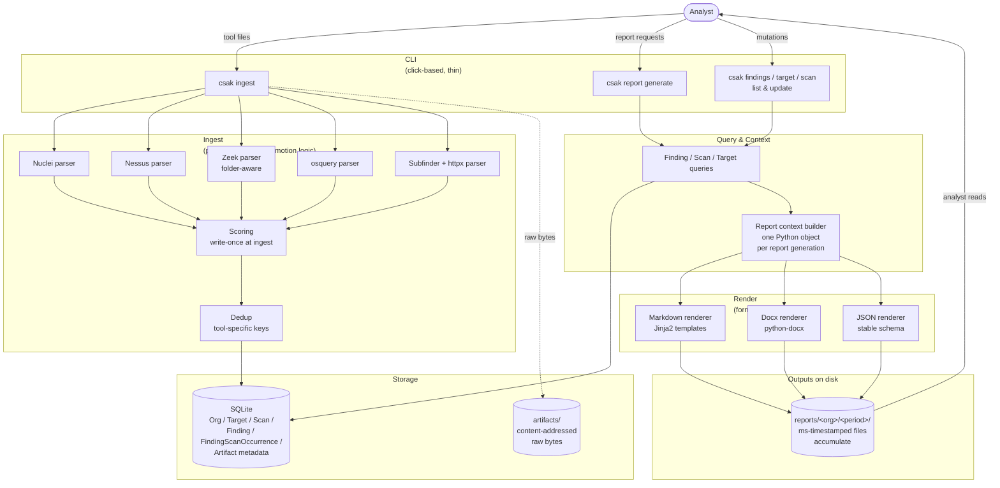

# Architecture Overview

> Companion to [[specs/slice-1|slice 1 spec]]. The spec is the authoritative source for every decision; this page is the map. A new contributor should be able to read this in five minutes and know where each responsibility lives and where to look in the spec for detail. This page also covers what [[architecture/data-flow|architecture/data-flow]] would have covered — the two have been folded together.
>
> **Slice 1 implemented 2026-04-24.** The module layout below matches the repository layout; the walkthrough matches shipped behavior.

## What CSAK is, briefly

CSAK ingests security-tool output, scores findings deterministically, and emits reports. Slice 1 is the pipeline from pre-collected tool output to rendered report. Tool orchestration (slice 2), recursion (slice 3), and LLM features (later slice) attach to the same pipeline without reshaping it.

The four-step product model is **intake → collect → triage → report**. Slice 1 ships intake (manual, via CLI), triage, and report. It does not ship collect — that's slice 2.

## System diagram



Two things worth noting about the diagram:

- **Arrows flow one way through the pipeline.** The ingest side writes to storage; the render side reads from it. No feedback loops in slice 1 — no retriage, no report-to-database writes, no cross-report comparison.
- **The render column is pluggable by format.** Adding HTML or PDF later means adding one more renderer that consumes the same report context. No changes upstream.

## Module boundaries

Five modules. Each owns a narrow responsibility; the boundaries match the diagram columns and the shipped repo's `src/csak/` layout.

### 1. CLI (thin, click-based)

**Owns:** argument parsing, command dispatch, user-facing output formatting (error messages, progress indicators, table output for `list` commands). Nothing more.

**Does not own:** business logic, data access, rendering. The CLI's `csak report generate` is a small handler that parses flags, calls the query layer, calls the context builder, calls the relevant renderers, and exits. Every substantive thing happens in the modules below.

**Lives in:** `csak/cli/` — one file per top-level command (`ingest.py`, `report.py`, `findings.py`, `target.py`, `scan.py`, `org.py`), plus `main.py` as the click group entrypoint.

**Why thin:** a fat CLI is the classic way to end up unable to build a TUI or web UI later. Slice 1 is CLI-only; slices 3+ might need a different front end. Keeping the CLI thin keeps that option alive.

**Table output convention:** every `list` command puts an `ID` column first (truncated to 8 characters for display). Downstream commands — `findings update`, `findings show`, `target update` — accept either the full UUID or any unambiguous prefix. This keeps the mutation workflow self-contained: the analyst never has to drop into sqlite3 to look up a row they can already see on screen.

### 2. Ingest (per-tool parsers + scoring + dedup)

**Owns:** taking a file path (or directory, for Zeek) and a tool identifier, producing Scans, Artifacts, and Findings. Assigning severity, confidence, and priority at the moment a Finding is first observed. Running dedup against existing Findings for the same Org.

**Does not own:** the database schema (that's storage), analyst-facing commands (that's CLI), the report rendering (that's render). An ingestor doesn't know what a Report is.

**Lives in:** `csak/ingest/` — one module per tool (`nuclei.py`, `nessus.py`, `zeek.py`, `osquery.py`, `probe.py` for Subfinder+httpx), plus `pipeline.py` as the orchestrator, `scoring.py` for the scoring formula and tables, `dedup.py` for the per-tool dedup keys, `targets.py` for the promotion logic, and `parser.py` for the shared parser interface.

**The parser interface** is the single seam: each parser exposes `parse(path) -> ParseResult` where `ParseResult` carries a `ParsedScan` plus a list of `ProtoFinding`. All five slice 1 parsers satisfy this. A sixth parser for reconFTW JSON or generic CSV is slice 2 work and slots into the same interface.

See [[specs/slice-1|slice 1 spec §Scoring]] and §Dedup for the rules each parser must respect.

### 3. Storage (SQLite + flat-file artifacts)

**Owns:** persistence. SQLite holds the entity rows (Org, Target, Scan, Finding, FindingScanOccurrence, Artifact metadata). The filesystem under `artifacts/<hash-prefix>/<hash>` holds raw tool-output bytes, content-addressed.

**Does not own:** rendered reports. Reports are export artifacts, not state. They live under `reports/` on disk and no SQLite row references them.

**Lives in:** `csak/storage/` — `schema.py` for the CREATE TABLE statements, `models.py` for the dataclass entity representations, `repository.py` for query and mutation helpers, `db.py` for connection setup, `artifacts.py` for the content-addressed file store.

**Why SQLite:** single-user, single-machine, zero deployment. If slice 2+ ever needs concurrent writers, Postgres becomes the right answer — but we'd rather solve that problem once we actually have it. See [[specs/slice-1|slice 1 spec §Storage]].

### 4. Query & Context

**Owns:** reading from storage for read-side operations. Two sub-responsibilities:

- **Query layer.** Generic "give me active Findings for Org X within time window Y" queries used by both the `list` commands and report generation. Understands `deleted_at`, `first_seen`/`last_seen` bounds, and joins across FindingScanOccurrence.
- **Report context builder.** Given (org, period, kind), assembles a single structured Python object holding the Findings, the Scans that contributed, the Targets those Findings attach to, methodology metadata, and grouping hints. This object is the input to every renderer.

**Does not own:** rendering. The context builder emits a data structure, not a document. The same context feeds markdown, docx, and JSON identically.

**Lives in:** `csak/query/` — `finders.py` for the generic queries, `context.py` for the report context builder and its dataclasses.

**Why a dedicated context builder:** it's the invariant that keeps the three render formats aligned. Every renderer reads the same object; same section order, same content, same source. See [[specs/slice-1|slice 1 spec §Report context — the shared input to all renderers]].

### 5. Render (format-specific, pluggable)

**Owns:** turning a report context into output files. Three renderers in slice 1.

- **Markdown renderer.** Jinja2 templates under `templates/markdown/<kind>.md.j2`. Primary authoring format.
- **Docx renderer.** python-docx walking the context and emitting document elements programmatically. A base template at `templates/docx/base.docx` defines styles; the renderer fills it in. First-pass docx prioritizes structure; typography polish is a second pass.
- **JSON renderer.** Serializes the context with a stable, versioned schema. Designed as the interface for the future LLM layer, not as a debug dump.

**Does not own:** the query that built the context, or deciding which formats to emit (that's the CLI based on `--format`).

**Lives in:** `csak/render/` — `markdown.py`, `docx_renderer.py`, `json_renderer.py`, plus `csak/templates/` alongside for the Jinja and docx base files.

**Extension point:** a new format (HTML, PDF, CSV) is a new file in `csak/render/` implementing the same renderer interface, plus a registration in the renderer registry. No changes elsewhere.

## End-to-end walkthrough

One concrete invocation, traced through every module.

### Setup: analyst has a Nessus scan

Analyst ran Nessus Essentials against `acmecorp.com` last night. The output is at `~/scans/acme-april.nessus`. They've created an Org for this client earlier via `csak org create acmecorp`.

### Step 1: ingest

```
csak ingest --org acmecorp --tool nessus ~/scans/acme-april.nessus
```

What happens, in order:

1. **CLI** parses the flags, resolves `acmecorp` to an Org ID via the storage layer, dispatches to the Nessus ingestor.
2. **Ingestor** opens the file, hashes its contents. Storage layer checks: is there already an Artifact row with this hash for this Org? If yes, skip to step 6 (dedup-only path). If no, proceed.
3. **Ingestor** writes the raw bytes to `artifacts/ab/ab3c7f…`, creates an Artifact row in SQLite pointing at it.
4. **Nessus parser** reads the XML, extracts `scan_started_at` / `scan_completed_at` from the embedded `HOST_START` / `HOST_END` host properties (`timestamp_source = extracted`), and emits a Scan row plus one proto-Finding per `<ReportItem>`.
5. For each proto-Finding:
   - **Target promotion logic** looks up the host in Targets for this Org. If it's a known Target, attach. If it's a subdomain string in some parent Target's `identifiers` list, promote to a child Target. If it's brand new, create a Target.
   - **Scoring** reads Nessus severity (`4 = Critical`, `3 = High`, …), maps via the per-tool table to CSAK's scale. Pulls confidence from the Nessus finding or the tool default. Reads `target_weight` from the Target. Computes `priority = severity_weight × confidence_weight × target_weight` and writes it to the Finding.
   - **Dedup** checks `(org_id, source_tool='nessus', plugin_id + host + port)`. If a matching Finding exists, advance its `last_seen`, add a FindingScanOccurrence row, done. If not, insert a new Finding.
6. **CLI** prints a summary: `Ingested scan <id>: 4 new, 0 re-occurrences, 2 targets touched`.

After this, SQLite holds the updated state. The raw `.nessus` file is preserved at `artifacts/ab/ab3c7f…`. No report has been generated yet.

### Step 2: list and triage

```
csak findings list --org acmecorp
```

Outputs a table with columns `ID / PRIORITY / SEVERITY / TOOL / TARGET / TITLE`, priority-descending. IDs are truncated to 8 characters. The analyst spots that the low-severity HTTP header disclosure is routine for this client.

```
csak findings update 30073971 --status suppressed
```

Prefix lookup resolves `30073971` to the full UUID. **Query layer** writes `status = suppressed` to the Finding and recomputes its priority defensively (same formula, same inputs, same output in this case — but the mutation path is uniform).

### Step 3: report generate

```
csak report generate --org acmecorp --period 2026-04 --kind internal-review --format markdown,docx,json
```

What happens:

1. **CLI** parses flags, dispatches to the report command handler.
2. **Query layer** runs: "Findings for `acmecorp` where `last_seen >= 2026-04-01` AND `first_seen < 2026-05-01` AND `status IN (active, accepted-risk)` AND `deleted_at IS NULL`." Returns a list of Findings, joined with their Targets and with the Scans they appeared in during the window (via FindingScanOccurrence). The suppressed finding from step 2 is correctly excluded.
3. **Context builder** assembles a Python `ReportContext` object: findings sorted by priority, grouped by severity, with methodology metadata recording which Scans contributed and whether any had `timestamp_source = fallback-ingested` (none in this case, since Nessus extracts cleanly). Includes Org info and the period bounds.
4. **Markdown renderer** walks the context, runs it through the `templates/markdown/internal-review.md.j2` Jinja template, writes `reports/acmecorp/2026-04/2026-04-24T08-51-36-115_internal-review.md`. Note the millisecond-precision timestamp prefix (`115`) — multiple invocations within the same second stay distinct.
5. **Docx renderer** copies `templates/docx/base.docx` to a new file, then programmatically adds headings, paragraphs, and tables matching the markdown output's structure. Writes `…_internal-review.docx`.
6. **JSON renderer** serializes the context with its schema-versioned shape. Writes `…_internal-review.json`.
7. **CLI** prints the three paths and exits.

**No writes to SQLite during step 3.** The report is a pure export.

### Step 4: adjust target weight

Analyst decides the web server matters more than average:

```
csak target update 1e4649fb --weight 1.5
```

- **CLI** dispatches to the query layer's update path.
- **Query layer** writes `target_weight = 1.5` on the Target, then walks every Finding attached to that Target and recomputes its priority. Other Targets and their Findings are untouched.
- Next report generation reflects the new priorities.

### Step 5: re-run the report

Analyst runs the same `report generate` command again. Every step repeats; a fresh set of three files is written with a new ms-timestamped prefix. The previous three files stay on disk. The period directory now has two sets of timestamped outputs. That's the history.

## Extension points

Where future work attaches to this architecture, in order of likelihood.

- **New tool parser** (slice 2 brings reconFTW JSON; later, generic CSV). Drop a new module into `csak/ingest/<tool>.py`. Implement the parser interface. Add severity mapping entries in `csak/ingest/scoring.py` (or a YAML config if that arrives first). Add a dedup-key rule in `csak/ingest/dedup.py`. That's it — no changes to storage, query, or render.
- **Tool execution** (slice 2). A new `csak/collect/` module runs tools and writes their output to disk as Artifacts. The ingest layer then picks them up exactly as it picks up analyst-provided files today. The existing pipeline stays unchanged; collect is a new on-ramp to the same pipeline.
- **New export format** (HTML, PDF, CSV — deferred). Drop a new renderer into `csak/render/<format>.py` implementing the renderer interface. Register it. The CLI's `--format` flag now accepts it. No changes upstream.
- **LLM layer** (later slice). Consumes the JSON export. Could be a new CLI command (`csak llm draft-impact --input <path-to-json>`) or a separate tool entirely; either way, the interface is the JSON schema, and CSAK's deterministic core never changes. See [[specs/slice-1|slice 1 spec §Report context]] for why the JSON shape is designed this way.
- **Scheduled invocation** (slice 4+). Wraps `csak report generate` on a cron or event trigger. CSAK itself doesn't need a scheduler — the OS provides one. If we later add cadence-aware features (like period summaries that diff against prior reports), *those* touch the data model; the scheduler itself doesn't.

## What's deliberately not covered here

Operational and engineering concerns that matter at build time but don't affect architecture:

- **Error handling strategy.** Which errors halt, which warn, which get retried. Addressed per-module during implementation.
- **Logging.** Structured vs. unstructured, log levels, where logs write. A build-time decision; the architecture doesn't care.
- **Concurrency.** Slice 1 is single-process, single-threaded for simplicity. Can ingest-while-querying later if needed, but SQLite in WAL mode handles it natively without architectural changes.
- **Config management.** Scoring tables live inline in `csak/ingest/scoring.py` for slice 1 (moving them to YAML files under `config/triage/severity/` is a slice 2 polish item); the rest (DB path, output path, defaults) is CLI flags or environment variables.
- **Testing strategy.** Every module above has obvious test seams (parsers are pure functions of input bytes, the context builder is a pure function of DB state, renderers are pure functions of context). Slice 1 ships with 83 tests covering all five parsers, scoring, dedup, query, context, three renderers, two CLI paths, and a full end-to-end flow.
- **Packaging and distribution.** CSAK ships as a pip-installable package with a `csak` entry point. Single-binary / Docker packaging is a later decision; doesn't affect any module boundary.

## How this relates to the spec

| Concept | Defined in the spec at | Referenced here |
|---------|----------------------|----------------|
| Data model (Org / Target / Scan / Finding / Artifact / FindingScanOccurrence) | [[specs/slice-1\|slice 1 spec §Data model]] | Storage module |
| Scoring rules and priority formula | [[specs/slice-1\|slice 1 spec §Scoring]] | Ingest module |
| Dedup keys per tool | [[specs/slice-1\|slice 1 spec §Dedup]] | Ingest module |
| Report kinds and section content | [[specs/slice-1\|slice 1 spec §Reports]] | Render module |
| Export formats | [[specs/slice-1\|slice 1 spec §Export formats]] | Render module |
| CLI surface | [[specs/slice-1\|slice 1 spec §Interface]] | CLI module |
| Storage choices | [[specs/slice-1\|slice 1 spec §Storage]] | Storage module |
| Exit criteria | [[specs/slice-1\|slice 1 spec §Exit criteria]] | (whole-system) |

If this overview and the spec disagree on a detail, **the spec wins.** This page is a map to the spec, not a replacement for it.

## Related

- [[specs/slice-1|Slice 1 — Ingest & Report]]
- [[product/vision|Vision]]
- [[product/slices|Slice Plan]]
- [[product/glossary|Glossary]]
